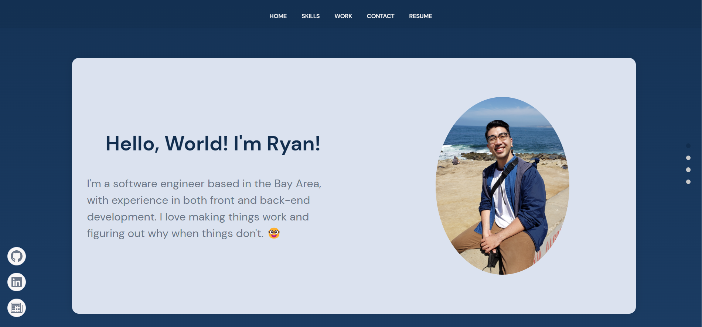
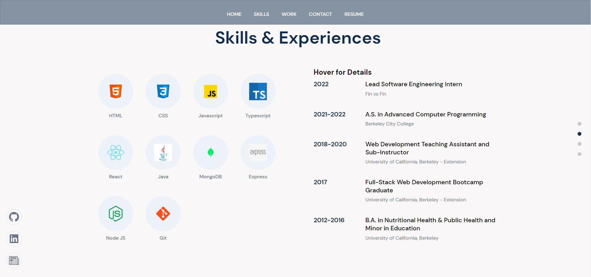
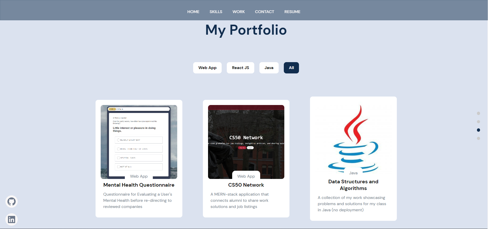
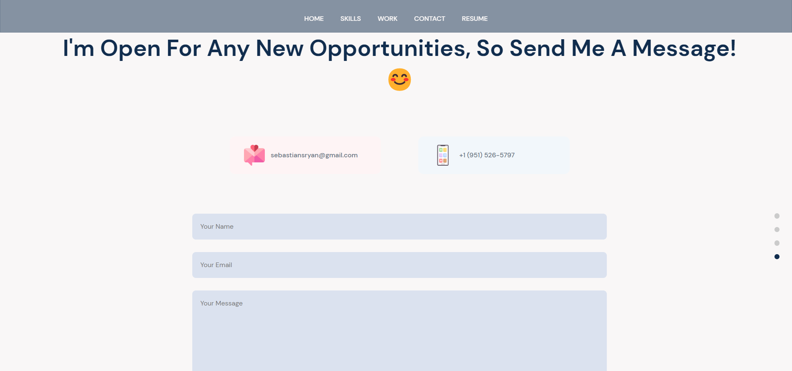

# Portfolio Site

This portfolio web app was built to promote myself! I'm looking for a new job in 2023 once I graduate so if you know of any opportunities, I'd be happy to connect! :)

## Tech Stack

**Client:** React, Framer Motion

**Server:** Node, Sanity.io

## Deployment

This project is currently deployed at https://www.rssebastian.com

## Screenshots

Header

Skills & Experience

Portfolio

Contact

## Acknowledgements

- [Adrian Hajdin](https://github.com/adrianhajdin) - Many thanks to his [course](https://www.youtube.com/watch?v=3HNyXCPDQ7Q) showing me how to implement Framer Motion and how to use Sanity.io for easy content management. The color palette has been changed and other design modifications were made, but I give Adrian credit for providing the foundation for me to showcase my skills.
